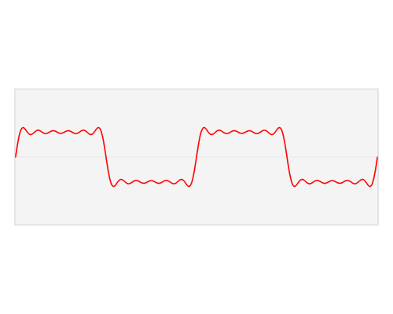

<div class="middle center">
<div style="width: 100%">

# 音乐在频域上的可视化

<hr/>

By [胥涵坤](https://xiu-zju.me)


</div>
</div>

<!--s-->

<div class="middle center">
<div style="width: 100%">

# Part.0 引入


</div>
</div>


<!--v-->

## 效果图
你能看出来这是什么歌吗？

<center>


</center>

~~（当然你不可能看得出来~~

<hr/>


<!--v-->

## 我怎么想到这个主题的
~~万恶的短学期课程（划掉~~
<center>

</center>


<!--s-->

<div class="middle center">
<div style="width: 100%">

# Part.1 原理讲解

</div>
</div>

<!--v-->

## 从正弦波到方波

正弦波大家都见过，就是$\sin$，$\cos$，这里统称正弦波。那么有没有想过，方波是什么样子的？如果你学过傅里叶变换，那么下意识的反应，方波是频率不同的正弦波的叠加。但是你要没有学过也没有关系，简单的来说，不同的正弦波(有不同的频率，不同的幅度，不同的相位，正弦波的三要素)可以组合出来方波。

<center>

</center>

<!--v-->

## 任意信号的分解

看过了上面的方波例子，信号其实可以被分解为频率不同的正弦波的叠加。然后将频率看作一个轴(将$f$看作$x$轴)，不同的频率的正弦波信号所占总信号的比例就用垂直于频率轴的一个轴可以进行表示(将他看作$y$轴)。这样我们就有了平时在音乐播放器中所看见的频谱。而这个频谱就是我们要可视化的东西。

<center>

</center>

<!--v-->
## 时域信号变频域信号
音频通常以时间为自变量表示，即$y=f(t)$，其中$t$表示时间，$y$表示该时刻的音量强度，这就是时域信号。相对地，频域信号表示为$z=g(f)$，其中$f$是频率，$z$表示某频率的信号成分大小，也可以理解为该信号与对应频率的正弦波相似度。相似度越高，表明该频率成分越强。

如何将$f(t)$变成$g(f)$呢？这里用到的是就是傅里叶变换。

<center>


</center>

<!--v-->
## 如何用计算机实现
计算机是二进制的，所以计算机只能处理离散的数据，所以将我们上面的东西迁移一下:我们的频域信号，也就是我们所要可视化的东西，变成了一串数据。此时下标代表的其实是频率。那么将时域变成频域的函数，就变成了fft(快速傅里叶变换)。
<center>


离散数据

</center>

<!--v-->

<div class="middle center">
<div style="width: 100%">

# 理论存在，实践开始！
<!--s-->

<div class="middle center">
<div style="width: 100%">

# Part.2 具体实现


<!--v-->

## 问题分解

这次要实现的东西主要实现音频播放时进行实时计算，然后将实时频域的图像绘制出来。对应此次任务就可以分解为三个部分，

1. 将音频播放出来，并可以实时读取播放的音频时域数据
2. 将拿到数据进行实时fft
3. 将fft的数据绘制出来


语言选择：
Python （伟大！

<center>

</center>


<!--v-->

## 任务一
```python
#音频流回调函数，会在音频chunk播放完后调用
def callback(indata, outdata, frames, time, status):
    frames = chunk_size #每次给流内推入chunk_size个数据
    global sound_chunk_idx
    #下面的if语句用来判断最后的音频不够chunk_size个值，防止程序出错
    if (music_data[chunk_size*sound_chunk_idx:chunk_size*(sound_chunk_idx+1), 0].size < chunk_size):
        raise sd.CallbackStop()
        return
    #推入流
    outdata[:] = music_data[chunk_size*sound_chunk_idx:chunk_size*(sound_chunk_idx+1), :]
    sound_chunk_idx += 1;
    #改变buffer, 生成动画
    buffer[:] = np.abs(fft(outdata[0:1024, 0]))[:512:8]
```
这里使用sounddevice这个库，通过Stream的方式进行播放，拿到实时的音频数据。你可以将音频想象成水，然后喇叭在河的下游，然后你将水(音频流)不断倒到河道中就可以让喇叭发出声音。

<!--v-->

## 任务二

这步比较简单，就是将时域数据通过fft变成频域数据。你会看到，这里有个buffer变量，它是一个全局变量，保存频域的实时数据，给后面绘图用。接下来，用到abs函数，这是因为数据转换后是复数，我们需要用abs取复数的模值，这样就能得到对应的能量大小。

```python
buffer[:] = np.abs(fft(outdata[0:1024, 0]))[:512:8]
```

<center>

</center>

<!--v-->
## 任务三

绘图。使用了matplotlib这个绘图库。基本思路是让matplotlib调用函数不断绘图，绘图的依据就是前面提到过buffer，通过播放时不断更新buffer中的值就可以变成实时频谱图了。

```python
fig, ax = plt.subplots(figsize=(18,9)) #画图的对象
ax.axis('off') #关闭坐标轴和边框
#初始化函数，第一帧
def init():
    ax.set_xlim(1, 65) #横轴的标
    ax.set_ylim(0, 3000000) #纵轴的坐标
    return ax.stem(buffer, buffer)
#更新函数，会在动画的每一帧调用
def update(frame):
    xdata = np.arange(1, 65) #共有65个数据点
    ydata = buffer #通过callback函数来改变buffer的值，然后让频谱动起来
    b_c = ax.stem(xdata, ydata, linefmt='--', markerfmt=None) #这里这里stem图
    return b_c #必须有
ani = FuncAnimation(fig, update, init_func=init, interval=20, blit=True)
plt.show(block=False)
```

<!--s-->

<div class="middle center">
<div style="width: 100%">

# 最终效果

<span style="background: linear-gradient(to right, orange, yellow, green); -webkit-background-clip: text; color: transparent; font-size: 34px; font-weight: bold;">
全体欣赏音乐
</span>

<!--s-->

<div class="middle center">
<div style="width: 100%">

# 谢谢！
<hr/>

By [胥涵坤](https://xiu-zju.me)

<!--s-->
<div class="middle center">
<div style="width: 100%">

# 问题解答（代码）
<!--v-->

## 代码详细解释

导入必要的库
```python
import numpy as np
import sounddevice as sd
import matplotlib.pyplot as plt
import subprocess
from sys import exit
from scipy.io import wavfile
from scipy.fftpack import fft
from matplotlib.animation import FuncAnimation
```

	•	numpy：用于数值运算和数组操作。
	•	sounddevice：用于处理音频输入和输出，播放和录制声音。
	•	matplotlib.pyplot：用于创建图形和可视化。
	•	subprocess：用于在 Python 中执行系统命令，这里用于调用ffmpeg进行音频格式转换。
	•	scipy.io.wavfile：用于读取和写入 WAV 格式的音频文件。
	•	scipy.fftpack.fft：用于对音频数据执行快速傅里叶变换(FFT)，以分析其频谱。
	•	matplotlib.animation.FuncAnimation：用于创建动画。

<!--v-->
## 代码详细解释
将 MP3 文件转换成 WAV 文件
```python
subprocess.call(['ffmpeg', '-i', './input/test.mp3', './output/test.wav'])
```
	•	调用 ffmpeg 将 test.mp3 转换为 test.wav，因为 wavfile 不支持 MP3 文件。
	•	使用 subprocess.call() 来运行命令行命令，-i 指定输入文件，./input/test.mp3 为源 MP3 文件，输出到 ./output/test.wav。

读取音频文件
```python
sr, music_data = wavfile.read('./output/test.wav')
if music_data.ndim > 1:
    music_data = music_data[:, 0]  # 如果是立体声，仅提取第一个通道
```
	•	使用 wavfile.read() 读取音频文件，返回采样率 sr 和音频数据 music_data。
	•	如果 music_data 是立体声（即包含多个通道），提取第一个通道的数据来简化分析。
<!--v-->
## 代码详细解释
初始化缓冲区和绘图对象
```python
buffer = np.zeros(64)  # 初始化缓冲区
fig, ax = plt.subplots(figsize=(18, 9))  # 创建绘图对象
ax.axis('off')  # 关闭坐标轴和边框
sound_chunk_idx = 0  # 音频块的索引
chunk_size = 1024  # 减小chunk大小以减缓卡顿
```
	•	buffer：用于存储音频数据的频谱数据。
	•	fig, ax：创建绘图对象，尺寸为 18x9。
	•	ax.axis('off')：关闭坐标轴和边框。
	•	sound_chunk_idx：跟踪当前播放的音频块。
	•	chunk_size：每次读取的音频样本数。
<!--v-->
## 代码详细解释

设置彩色渐变效果
```python
colors = plt.cm.viridis(np.linspace(0.5, 1, len(buffer)))
bars = ax.bar(range(len(buffer)), buffer, color=colors)
```
	•	plt.cm.viridis()：获取 viridis 颜色映射（蓝色到黄色的渐变）。
	•	ax.bar()：创建柱状图，并将颜色应用到每个柱上。

初始化函数
```python
def init():
    ax.set_xlim(0, 64)  # 横轴范围
    ax.set_ylim(0, 3000000)  # 纵轴范围，根据实际音频频谱调整
    return bars
```
	•	初始化动画的第一帧，设置横轴范围 0-64（缓冲区长度）和纵轴范围 0-3000000（用于控制柱状图的高度）。

<!--v-->
## 代码详细解释
更新函数
```python
def update(frame):
    for bar, h in zip(bars, buffer):  # 根据buffer更新每个bar的高度
        bar.set_height(h)
    return bars
```
	•	每一帧更新 bars 的高度，以显示音频频谱的变化。
	•	zip(bars, buffer) 将 bars 和 buffer 配对，通过设置柱状图的高度来更新动画。
<!--v-->

音频流回调函数
```python
def callback(indata, outdata, frames, time, status):
    global sound_chunk_idx

    # 检查剩余数据是否小于chunk_size，避免出错
    if music_data[sound_chunk_idx * chunk_size : (sound_chunk_idx + 1) * chunk_size].size < chunk_size:
        raise sd.CallbackStop()
    
    # 提取音频数据并推入流
    outdata[:, 0] = music_data[sound_chunk_idx * chunk_size : (sound_chunk_idx + 1) * chunk_size]
    sound_chunk_idx += 1

    # 更新缓冲区，生成动画效果
    buffer[:] = np.abs(fft(outdata[:1024, 0]))[:64]  # 计算频谱并缩小显示范围
```
	•	callback 是音频播放时的回调函数，用于实时更新音频数据和频谱可视化。
	•	sound_chunk_idx：在 chunk_size 范围内提取音频数据块。
	•	outdata[:, 0] = ...：将数据写入 outdata，用于播放音频。
	•	fft：对当前音频数据进行快速傅里叶变换，计算音频的频谱并更新缓冲区 buffer。

<!--v-->
设置动画
```python
ani = FuncAnimation(fig, update, init_func=init, interval=1, blit=True)
plt.show(block=False)
```
	•	FuncAnimation：使用 init 和 update 函数来生成动画。
	•	plt.show(block=False)：显示动画图形并继续执行脚本。


打开音频流并等待用户退出
```python
with sd.Stream(callback=callback, samplerate=sr, blocksize=chunk_size, dtype=music_data.dtype):
    print("Enter q or Q to exit:")
    while True:
        response = input()
        if response in ('', 'q', 'Q'):
            break
```
	•	sd.Stream(...)：创建音频流，使用回调函数 callback 实现音频播放。
	•	print 提示用户可以按 q 或 Q 退出音频播放。


<!--s-->
<div class="middle center">
<div style="width: 100%">

# 问题解答（fft）

<!--v-->
## 快速傅里叶变换

**FFT**的核心思想是**分治**。就**DFT**来说，它分治地求解$x=\omega_n^k$时的$f(x)$的值。

也就是，它选用单位复根的 $0$ 到 $ n - 1$ 次幂作为点值，进行系数表示转点值表示的操作。

其分治思想体现在将多项式**分为奇次项与偶次项**处理，从而使暴力代入的 $ O(n^2) $  复杂度降为 $ O(n\log n)$ .
<!--v-->
以共有 $8$  项的  $7$  次多项式为例：

$$ f(x) = a_0 + a_1x + a_2x^2 + a_3x^3 + a_4x^4 + a_5x^5 + a_6x^6 + a_7x^7 $$

按照次数奇偶分组后，对奇次项组提出一个 $x$ ：

$$ \begin{aligned} f(x) & = a_0 + a_1x + a_2x^2 + a_3x^3 + a_4x^4 + a_5x^5 + a_6x^6 + a_7x^7 \\\\& = (a_0 + a_2x^2 + a_4x^4 + a_6x^6) + (a_1x + a_3x^3 + a_5x^5 + a_7x^7) \\\\& = (a_0 + a_2x^2 + a_4x^4 + a_6x^6) + x(a_1 + a_3x^2 + a_5x^4 + a_7x^6) \end{aligned} $$

两边形式高度类似，构造两个新函数：

$$ \begin{aligned} F(x) = a_0 + a_2x + a_4x^2 + a_6x^3 \\\\G(x) = a_1 + a_3x + a_5x^2 + a_7x^3 \\\\\end{aligned} $$
<!--v-->
那么：

$$ f(x) = F(x^2) + x \times G(x^2) $$

接下来用上单位复根的性质：

$$ \begin{aligned} \operatorname{DFT}(f(\omega _{n}^k)) & = \operatorname{DFT}(F(\omega_n^{2k})) + \omega_n^k \times \operatorname{DFT}(G(\omega_n^{2k})) \\\\& = \operatorname{DFT}(F(\omega _{n/2}^{k})) + \omega_n^k \times \operatorname{DFT}(G(\omega _{n/2}^{k})) \end{aligned} $$

同理有：

$$ \begin{aligned}
\operatorname{DFT}(f(\omega _{n}^{k+n/2})) & = \operatorname{DFT}(F(\omega_n^{2k+n})) + \omega_n^{k+n/2} \times \operatorname{DFT}(G(\omega_n^{2k+n})) \\\\& = \operatorname{DFT}(F(\omega_n^{2k})) - \omega_n^k \times \operatorname{DFT}(G(\omega_n^{2k})) \\\\& = \operatorname{DFT}(F(\omega _{n/2}^{k})) - \omega_n^k \times \operatorname{DFT}(G(\omega _{n/2}^{k}))
\end{aligned} $$
<!--v-->
那么只要求出 $\operatorname{DFT}(F(\omega _{n/2}^k))$ 与 $\operatorname{DFT}(G(\omega _{n/2}^k))$ ，就可以求出 $\operatorname{DFT}(f(\omega _{n}^{k}))$ 与 $\operatorname{DFT}(f(\omega _{n}^{k+n/2}))$ .

为什么需要区分左半边和右半边呢？因为 $2k > n$ 时，可以将 $2k$ 减去一个周期 $n$ ，实质上计算的是一样的东西。

递归求解即可。可知时间复杂度表达式：
$$T(n) = 2 \times T(n/2) + O(n)$$
根据主定理或者递归树，可知时间复杂度为$O(n\log{n})$。


>在实现中，需要注意分治 DFT 处理的多项式的长度必须是 $2^m,m \in \mathbf{N^*}$ ，所以需要将原多项式补充长度。
